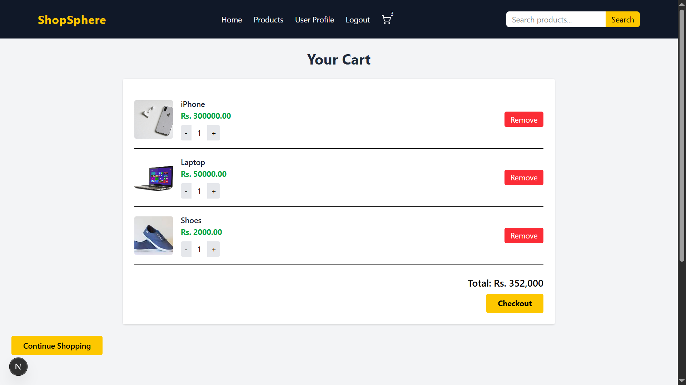
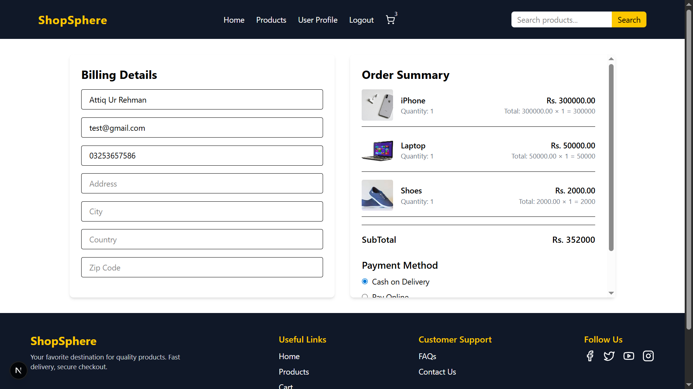
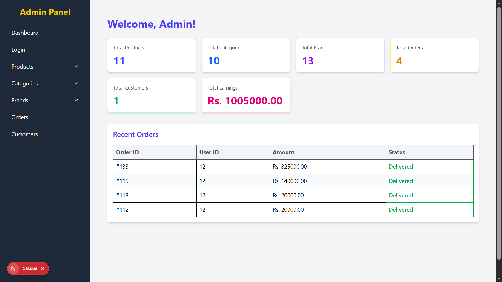

# 🛒 NextJS-PHP E-Commerce – Full Stack Project

NextJS-PHP E-Commerce is a complete **E-Commerce web application** built with **Next.js (frontend)** and **PHP/MySQL (backend APIs)**.  
It includes all essential features of an online store such as product management, shopping cart, checkout, order system, and payment integration.

---

## 🚀 Features

- 🔑 User authentication (login/register)  
- 📦 Product listing with categories  
- 🖼 Product details page with images, price, and description  
- 🛒 Shopping cart & quantity management  
- 🧾 Checkout with billing details form  
- 💰 Order summary & subtotal calculation  
- 💳 Multiple payment methods:
  - Cash on Delivery
  - Stripe Online Payment  
- 🛠 Admin Panel (PHP backend):
  - Add, Edit, Delete products  
  - Manage orders & users  

---

## 🖼 Preview

🏠 Home Page  
🛒 Cart Page  
💳 Checkout Page  
⚙️ Admin Panel  

  
  
  
  

---

## 🛠 Tech Stack

### Frontend
- [Next.js 15.3.3](https://nextjs.org/)  
- [React](https://react.dev/)  
- [Tailwind CSS](https://tailwindcss.com/)  

### Backend
- [PHP](https://www.php.net/) (API development)  
- [MySQL](https://www.mysql.com/) (Database)  
- [XAMPP](https://www.apachefriends.org/) (Local server)  

---

## 📂 Project Structure

nextjs-php-ecommerce/
│
├── frontend/ # Next.js app (React + Tailwind)
│ ├── pages/
│ ├── public/
│ ├── components/
│
├── backend/ # PHP APIs + Admin panel
│ ├── admin_area/
│ ├── user_area/
│ ├── config/
│
└── README.md

---

## ⚡ Installation & Setup

### 1️⃣ Clone Repository
```bash
git clone https://github.com/attiq-ur-rehman4855/nextjs-php-ecommerce.git
cd nextjs-php-ecommerce

2️⃣ Frontend Setup (Next.js)

cd frontend
npm install
npm run dev
Now open 👉 http://localhost:3000

3️⃣ Backend Setup (PHP APIs)

Copy backend/ folder to your XAMPP htdocs
Example: C:\xampp\htdocs\backend

Import database from /backend/database/ecommerce.sql into phpMyAdmin

Update database credentials inside backend/config.php


## 👨‍💻 Author  

- **Attiq Ur Rehman**  
  👉 [GitHub Profile](https://github.com/attiq-ur-rehman4855)
